<div align="center">

<a href="https://buntatoes.github.io/buntatoes/">
  
</a>

# Buntos

Local tools. Human review. Linux.

Four little Grok-bots on a dark desk. Click a face. Ask it something. Watch the eyes follow you.

[sit at the desk](https://buntatoes.github.io/buntatoes/) · [language sky](https://buntatoes.github.io/buntatoes/langs.html)

</div>

## Currently shipping

| Bot | What it is | Stack |
| --- | --- | --- |
| [Holdfast](https://github.com/buntatoes/holdfast) | Linux gate under a coding agent. File, shell, and net wait for you. Fail-closed. | Python · Linux |
| [ChorusDraft](https://github.com/buntatoes/chorusdraft) | Human-reviewed drafts for Bluesky and Mastodon. Models write. You ship. | Elixir |
| [AdAegis](https://github.com/buntatoes/adaegis) | Small ad blocker for desktop Chrome / Chromium 120+. Lists stay on disk. | JavaScript |
| [Lang](https://buntatoes.github.io/buntatoes/langs.html) | A night field of languages this profile actually ships. Year east, rank high. | the sky |

<div align="center">

<table>
  <tr>
    <td align="center" width="25%" valign="top">
      <a href="https://buntatoes.github.io/buntatoes/#holdfast">
        
      </a>
      <br />
      <strong>Holdfast</strong>
      <br />
      <sub>Linux gate</sub>
    </td>
    <td align="center" width="25%" valign="top">
      <a href="https://buntatoes.github.io/buntatoes/#chorus">
        
      </a>
      <br />
      <strong>ChorusDraft</strong>
      <br />
      <sub>Social drafts</sub>
    </td>
    <td align="center" width="25%" valign="top">
      <a href="https://buntatoes.github.io/buntatoes/#aegis">
        
      </a>
      <br />
      <strong>AdAegis</strong>
      <br />
      <sub>Ad block</sub>
    </td>
    <td align="center" width="25%" valign="top">
      <a href="https://buntatoes.github.io/buntatoes/#lang">
        
      </a>
      <br />
      <strong>Lang</strong>
      <br />
      <sub>Language field</sub>
    </td>
  </tr>
</table>

</div>

<details>
<summary><strong>Holdfast</strong> — the lock stays on until a human says otherwise</summary>

<br />

Agents propose open, exec, and connect. Holdfast intercepts the call. Policy or a person allows it. Missing daemon, unknown op, timeout: deny. Prompts are not a security boundary; the gate does not read them. Linux only. No phone-home.

</details>

<details>
<summary><strong>ChorusDraft</strong> — drafts leave the machine after review</summary>

<br />

Elixir, Bluesky and Mastodon, local queues split by service and account. Voice is dry wit; serious topics stay sincere. Guard screens publication. Official builds sign Guard and refuse to run without it. It does not auto-like, favourite, boost, or repost.

</details>

<details>
<summary><strong>AdAegis</strong> — network block on, lists local</summary>

<br />

A small unpacked extension for desktop Chrome and Chromium 120+. Bundled rules for common ad-tech domains. Page cleanup and YouTube filtering start off. No account, no telemetry, no remote filter list, no Chrome Web Store listing. Load the zip; leave the folder where Chrome can find it.

</details>

<details>
<summary><strong>Lang</strong> — year drifts east, rank hangs higher</summary>

<br />

Fifteen languages, including Ruby and Elixir because this profile ships them. Click an orb, scrub the year, or walk the list with <kbd>j</kbd> / <kbd>k</kbd>. Ranks blend public indexes with what actually lives on this desk.

</details>

## Sit at the desk

The [Pages desk](https://buntatoes.github.io/buntatoes/) is the interactive profile. The README is the roster.

- Click a face, or press `1`–`4`, or `j` / `k`
- Tap a chip, or type a question in the ask bar (`/`)
- Poke the big face for a short reaction
- Eyes follow the pointer
- `?` opens the legend
- `#chorusdraft` and `#adaegis` still land on the right bot

I tinker with local-first tools, Linux, and agents that do not get a free pass at the syscall. A model may draft. A human still ships.

<details>
<summary>Run the desk locally</summary>

<br />

Static GitHub Pages. From `docs/`:

```bash
python3 -m http.server 43147
```

Then open `http://127.0.0.1:43147/`.
</details>
